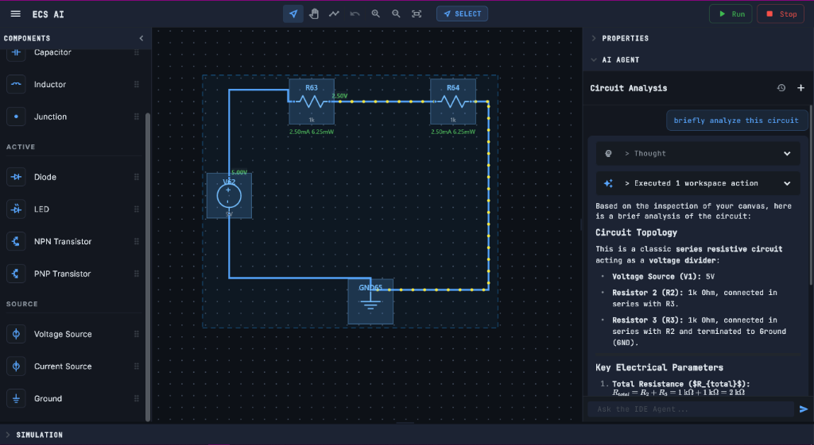
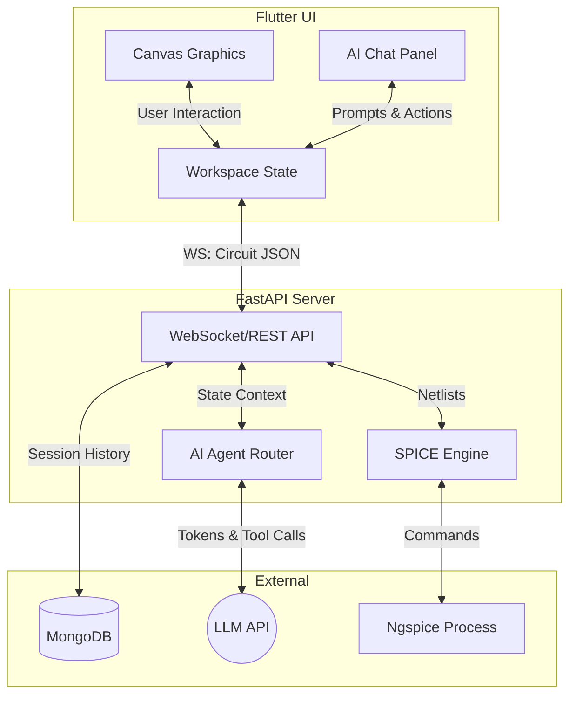

# Electronic Circuit Simulator AI (ECS AI)

A modern, high-performance Electronic Design Automation (EDA) and schematic capture tool. It features a custom Flutter graphics engine, a Python-powered SPICE simulation backend, and deep AI co-pilot capabilities to assist in real-time circuit design, simulation, and troubleshooting.

## Tech Stack

* **Frontend**: Flutter (Dart) for high-performance, 60fps canvas rendering across Desktop, Web, and Mobile.
* **Backend**: FastAPI (Python) for ultra-fast WebSocket communication, REST endpoints, and system orchestration.
* **Simulation Core**: PySpice & Ngspice for accurate physics and electronic node calculations.
* **Database**: MongoDB for saving circuit topologies, user data, and AI chat sessions persistently.
* **AI Integration**: Custom Agentic reasoning loops using external LLMs to interact with the circuit state.

## Features

### AI Features
* **AI Co-pilot Chat**: An integrated intelligent assistant that can answer questions about your circuit or electronics concepts.
* **Autonomous Circuit Design**: The AI can actively modify, add, or fix components on your canvas directly from the chat.
* **Automated Troubleshooting**: Automatically detects simulation errors and provides actionable, step-by-step resolution reasoning.
* **Streaming Reasoning**: See the AI's "thought process" streamed live to the UI before it takes action on your circuit.

### Frontend Features
* **Infinite Hardware Canvas**: Custom transformation matrices supporting infinite pan, zoom, and continuous sub-grid alignments.
* **Orthogonal Wiring**: Manhattan-style routing algorithm that supports rigid corner-locking drops and multi-segment axis constraint topologies.
* **Animated Current Flow**: Dynamic, real-time visualization of current direction and magnitude moving through wires.
* **Live Diagnostic Overlays**: Hover over components to instantly view calculated current, power, and voltage drops.
* **Cross-Platform**: Seamlessly runs on Windows desktop, macOS, Linux, and Web browsers.

### Backend Features
* **Real-time SPICE Integration**: Instantly translates the frontend JSON schematic into a SPICE netlist and executes Operating Point analyses.
* **Robust WebSocket Streaming**: Decoupled, bi-directional sockets for both continuous simulation polling and asynchronous AI streaming.
* **Dynamic Metric Extraction**: Calculates directional KCL/KVL metrics on the fly (pin currents, voltage drops, power dissipation).

## Architecture Flow

##  Example Workflow

1. **Start a Design**: The user opens the application and drops a Voltage Source and a Resistor onto the infinite canvas using the left toolbar.
2. **Wire the Circuit**: Using the Wire tool (hotkey **W**), the user clicks to connect the pins of the components, creating a closed loop. The wire router automatically generates clean, right-angled paths.
3. **Run Simulation**: The user clicks the **Simulate** button. The frontend sends the circuit JSON to the Python backend over a WebSocket. The backend translates it to a SPICE netlist, runs Ngspice, and returns the nodal voltages and pin currents.
4. **Visual Feedback**: Instantly, animated yellow electrons begin flowing around the wires on the canvas, indicating the direction of current.
5. **AI Interaction**: The user isn't sure how to add an LED without burning it out. They open the AI Chat Panel and ask: *"How do I safely add an LED to this circuit?"*
6. **AI Action**: The AI Agent reads the live canvas state, calculates the required series resistance, explains its reasoning in the chat, and uses a tool to autonomously spawn an LED and modify the resistor value right on the user's screen.
