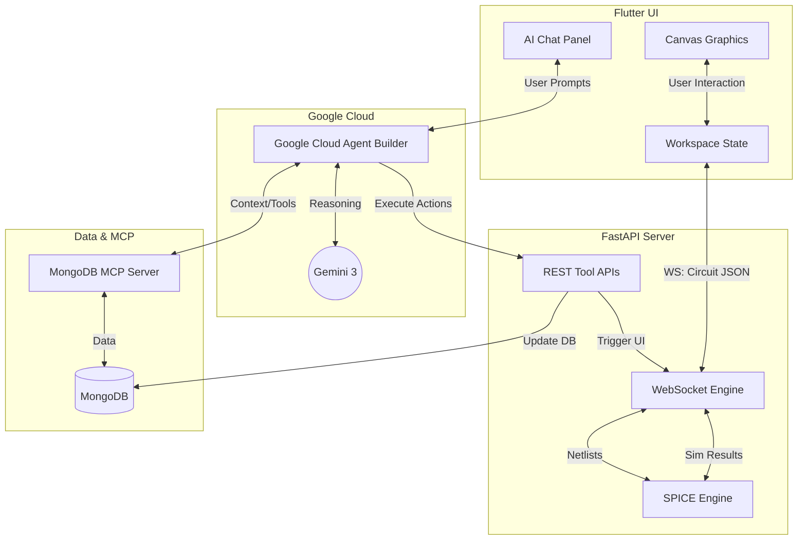

# Electronic Circuit Simulator AI (ECS AI)
*(Built for the Google Cloud Rapid Agent Hackathon)*

A modern, high-performance Electronic Design Automation (EDA) and schematic capture tool. It features a custom Flutter graphics engine, a Python-powered SPICE simulation backend, and deep AI co-pilot capabilities powered by **Google Cloud Agent Builder** and **Gemini 3** to assist in real-time circuit design, simulation, and troubleshooting.

## Tech Stack

* **Frontend**: Flutter (Dart) for high-performance, 60fps canvas rendering across Desktop, Web, Tablet.
* **Backend**: FastAPI (Python) for ultra-fast WebSocket communication, REST endpoints, and system orchestration.
* **Simulation Core**: PySpice & Ngspice for accurate physics and electronic node calculations.
* **Database & MCP**: MongoDB Atlas for saving user data, integrated natively via the **MongoDB Model Context Protocol (MCP) Server**.
* **AI Integration**: **Google Cloud Agent Builder** and **Gemini 3** orchestrating autonomous circuit design and reasoning via REST tool endpoints.

## Features

### Agentic Orchestration (Powered by Gemini & Agent Builder)
* **State-Injected Contextual Awareness**: Real-time circuit topologies are serialized directly into the agent's system prompt, eliminating inspect-loop latency for instant reasoning.
* **Autonomous Schematic Manipulation**: Gemini securely invokes OpenAPI-compliant REST endpoints to programmatically inject, modify, or tear down schematic elements.
* **Heuristic Diagnostics**: The agent proactively intercepts simulation failures, cross-referencing node physics to generate actionable, multi-step resolution strategies.
* **MCP Data Grounding**: Natively leverages the MongoDB Model Context Protocol (MCP) server to semantically query historical project schemas and component metadata.

### High-Fidelity IDE (Flutter Canvas Engine)
* **Unbound Spatial Canvas**: Employs custom mathematical transformation matrices for hardware-accelerated, infinite panning and sub-grid precision alignment.
* **Orthogonal Routing Heuristics**: Manhattan-style wire routing algorithm enforcing rigid, non-overlapping corner locks across multi-segment axis topologies.
* **Live Diagnostic Overlays**: High-performance, floating UI overlays instantly display reactive SPICE metrics (Current, Voltage, Power) upon cursor hover events.
* **Electron-Flow Telemetry**: Smooth 60fps kinetic animation visualizing magnitude and direction of current flow across nodal wires.
* **Professional UI Architecture**: Modern, dark-themed UI components built with robust flex-layouts and custom typography, completely avoiding default structural overflows.

### Hybrid Backend Architecture
* **Synchronous SPICE Translation**: Low-latency translation layer mapping JSON-defined node graphs into valid Ngspice netlists for Operating Point (OP) analysis.
* **Bi-directional WebSocket Pipeline**: Decoupled socket architecture for continuous telemetry streaming, syncing hardware physics back to the UI state without polling latency.
* **Exposed IDE Toolchain**: Core system tools (`ide_tools`) are abstracted and secured as modular REST APIs, serving as the bridge for external autonomous agent execution.

## Architecture Flow (Hybrid Model)

## Example Workflow

1. **Start a Design**: The user opens the application and drops a Voltage Source and a Resistor onto the infinite canvas using the left toolbar.
2. **Wire the Circuit**: Using the Wire tool (hotkey **W**), the user clicks to connect the pins of the components, creating a closed loop. The wire router automatically generates clean, right-angled paths.
3. **Run Simulation**: The user clicks the **Simulate** button. The frontend sends the circuit JSON to the Python backend over a WebSocket. The backend translates it to a SPICE netlist, runs Ngspice, and returns the nodal voltages and pin currents.
4. **Visual Feedback**: Instantly, animated yellow electrons begin flowing around the wires on the canvas, indicating the direction of current.
5. **AI Interaction**: The user isn't sure how to add an LED without burning it out. They open the AI Chat Panel and ask: *"How do I safely add an LED to this circuit?"*
6. **Agent Builder Execution**: The Agent Builder leverages the MongoDB MCP Server to look up component specs, uses Gemini 3 to calculate the required series resistance, and hits the backend's REST tool endpoint (`/api/tools/add_component`).
7. **Hybrid Update**: The backend adds the new components to the database and immediately broadcasts the updated circuit to the frontend via WebSocket, modifying the circuit right before the user's eyes in real-time.
