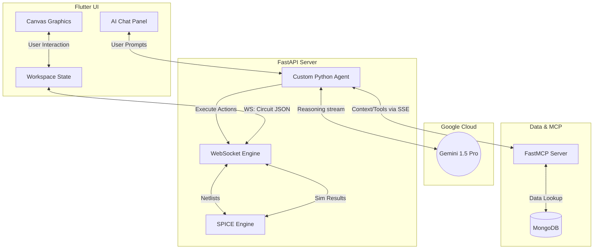

# Electronic Circuit Simulator AI (ECS AI)


A modern, high-performance Electronic Design Automation (EDA) and schematic capture tool. It features a custom Flutter graphics engine, a Python-powered SPICE simulation backend, and deep AI co-pilot capabilities powered by **Gemini 1.5 Pro** to assist in real-time circuit design, simulation, and troubleshooting.


## Tech Stack

* **Frontend**: Flutter (Dart) for high-performance, 60fps canvas rendering across Desktop, Web, Tablet.
* **Backend**: FastAPI (Python) for ultra-fast WebSocket communication, REST endpoints, and system orchestration.
* **Simulation Core**: PySpice & Ngspice for accurate physics and electronic node calculations.
* **Database & MCP**: MongoDB, integrated natively via a custom Python **FastMCP Server** to provide the agent with real-time hardware component data.
* **AI Integration**: **Google GenAI SDK** and **Gemini 1.5 Pro** orchestrating an asynchronous, autonomous agent capable of driving the simulation engine via decoupled tools.

## Features

### Agentic Orchestration (Powered by Gemini 1.5 Pro)
* **State-Injected Contextual Awareness**: Real-time circuit topologies are serialized directly into the agent's system prompt, eliminating inspect-loop latency for instant reasoning.
* **Autonomous Schematic Manipulation**: The custom agent securely maps Gemini's function calls to your local functions to programmatically inject, modify, or tear down schematic elements on the live canvas.
* **Heuristic Diagnostics**: The agent proactively intercepts simulation failures, cross-referencing node physics to generate actionable, multi-step resolution strategies.
* **MCP Data Grounding**: Natively leverages a Python FastMCP server to semantically query MongoDB for historical project schemas and component metadata, achieving "Beyond-Chat" agency.

### High-Fidelity IDE (Flutter Canvas Engine)
* **Unbound Spatial Canvas**: Employs custom mathematical transformation matrices for hardware-accelerated, infinite panning and sub-grid precision alignment.
* **Orthogonal Routing Heuristics**: Manhattan-style wire routing algorithm enforcing rigid, non-overlapping corner locks across multi-segment axis topologies.
* **Live Diagnostic Overlays**: High-performance, floating UI overlays instantly display reactive SPICE metrics (Current, Voltage, Power) upon cursor hover events.
* **Electron-Flow Telemetry**: Smooth 60fps kinetic animation visualizing magnitude and direction of current flow across nodal wires.
* **Professional UI Architecture**: Modern, dark-themed UI components built with robust flex-layouts and custom typography, completely avoiding default structural overflows.

### Hybrid Backend Architecture
* **Synchronous SPICE Translation**: Low-latency translation layer mapping JSON-defined node graphs into valid Ngspice netlists for Operating Point (OP) analysis.
* **Bi-directional WebSocket Pipeline**: Decoupled socket architecture for continuous telemetry streaming, syncing hardware physics back to the UI state without polling latency.
* **Proxy Tool Execution**: Core system tools (`ide_tools`) are bound to the cloud agent via the FastMCP server, serving as the bridge for autonomous agent execution and real-time state broadcasting.

## Architecture Flow (Custom Agent Model)



## Example Workflow

1. **Start a Design**: The user opens the application and drops a Voltage Source and a Resistor onto the infinite canvas using the left toolbar.
2. **Wire the Circuit**: Using the Wire tool (hotkey **W**), the user clicks to connect the pins of the components, creating a closed loop. The wire router automatically generates clean, right-angled paths.
3. **Run Simulation**: The user clicks the **Simulate** button. The frontend sends the circuit JSON to the Python backend over a WebSocket. The backend translates it to a SPICE netlist, runs Ngspice, and returns the nodal voltages and pin currents.
4. **Visual Feedback**: Instantly, animated yellow electrons begin flowing around the wires on the canvas, indicating the direction of current.
5. **AI Interaction**: The user isn't sure how to add an LED without burning it out. They open the AI Chat Panel and ask: *"How do I safely add an LED to this circuit?"*
6. **Autonomous Agent Execution**: The custom agent leverages the FastMCP Server to look up component specs, uses Gemini 1.5 Pro to calculate the required series resistance, and invokes its native tools to execute the placement and configure the Transient simulation.
7. **Live Broadcast Update**: The backend updates the session and immediately broadcasts the updated circuit to the frontend via WebSocket, modifying the circuit right before the user's eyes in real-time.

## Setup & Demo Instructions

We have packaged the codebase to be easily run by judges locally:

1. Ensure you have **Python 3.12+** and **Flutter 3.22+** installed on your machine.
2. In the `backend` folder, install the required python packages:
   ```bash
   cd backend
   python -m venv venv
   venv\Scripts\activate
   pip install -r requirements.txt
   ```
3. Set your API keys in `backend/.env`:
   ```env
   GEMINI_API_KEY=your_gemini_key_here
   MONGO_URI=mongodb://localhost:27017
   ```
4. Double click the **`start_demo.bat`** file in the root directory! This script will automatically boot up both the FastAPI backend and the Flutter Web Server simultaneously.
5. Open your browser to `http://localhost:3000` to start exploring the IDE!

## License

This project is licensed under the MIT License - see below for details:

```text
MIT License

Copyright (c) 2026 ECS-AI Team

Permission is hereby granted, free of charge, to any person obtaining a copy
of this software and associated documentation files (the "Software"), to deal
in the Software without restriction, including without limitation the rights
to use, copy, modify, merge, publish, distribute, sublicense, and/or sell
copies of the Software, and to permit persons to whom the Software is
furnished to do so, subject to the following conditions:

The above copyright notice and this permission notice shall be included in all
copies or substantial portions of the Software.

THE SOFTWARE IS PROVIDED "AS IS", WITHOUT WARRANTY OF ANY KIND, EXPRESS OR
IMPLIED, INCLUDING BUT NOT LIMITED TO THE WARRANTIES OF MERCHANTABILITY,
FITNESS FOR A PARTICULAR PURPOSE AND NONINFRINGEMENT. IN NO EVENT SHALL THE
AUTHORS OR COPYRIGHT HOLDERS BE LIABLE FOR ANY CLAIM, DAMAGES OR OTHER
LIABILITY, WHETHER IN AN ACTION OF CONTRACT, TORT OR OTHERWISE, ARISING FROM,
OUT OF OR IN CONNECTION WITH THE SOFTWARE OR THE USE OR OTHER DEALINGS IN THE
SOFTWARE.
```
