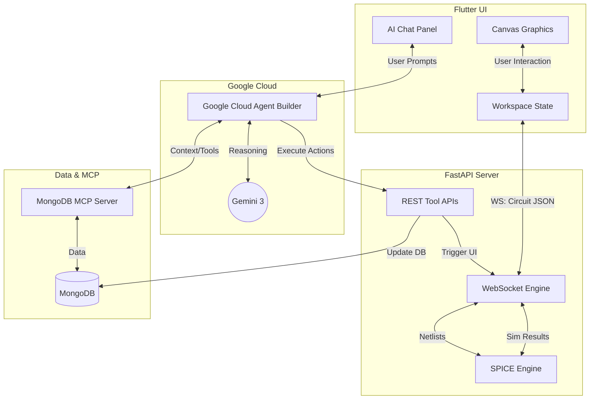

# Electronic Circuit Simulator AI (ECS AI)
*(Built for the Google Cloud Rapid Agent Hackathon)*

A modern, high-performance Electronic Design Automation (EDA) and schematic capture tool. It features a custom Flutter graphics engine, a Python-powered SPICE simulation backend, and deep AI co-pilot capabilities powered by **Google Cloud Agent Builder** and **Gemini 3** to assist in real-time circuit design, simulation, and troubleshooting.

## Tech Stack

* **Frontend**: Flutter (Dart) for high-performance, 60fps canvas rendering across Desktop, Web, Tablet.
* **Backend**: FastAPI (Python) for ultra-fast WebSocket communication, REST endpoints, and system orchestration.
* **Simulation Core**: PySpice & Ngspice for accurate physics and electronic node calculations.
* **Database & MCP**: MongoDB Atlas for saving user data, integrated natively via the **MongoDB Model Context Protocol (MCP) Server**.
* **AI Integration**: **Google Cloud Agent Builder** and **Gemini 3** orchestrating autonomous circuit design and reasoning via REST tool endpoints.

## Features

### AI Features (Powered by Gemini & Agent Builder)
* **AI Co-pilot Chat**: An integrated intelligent assistant that can answer questions about your circuit or electronics concepts.
* **Autonomous Circuit Design**: The AI can actively modify, add, or fix components on your canvas directly from the chat.
* **Automated Troubleshooting**: Automatically detects simulation errors and provides actionable, step-by-step resolution reasoning.
* **Component Catalog & History**: Leverages the MongoDB MCP Server to intelligently search for components and load past projects.

### Frontend Features
* **Infinite Hardware Canvas**: Custom transformation matrices supporting infinite pan, zoom, and continuous sub-grid alignments.
* **Orthogonal Wiring**: Manhattan-style routing algorithm that supports rigid corner-locking drops and multi-segment axis constraint topologies.
* **Animated Current Flow**: Dynamic, real-time visualization of current direction and magnitude moving through wires.
* **Live Diagnostic Overlays**: Hover over components to instantly view calculated current, power, and voltage drops.
* **Cross-Platform**: Seamlessly runs on Windows desktop, Web browsers and Android tablets.

### Backend Features (Hybrid Architecture)
* **Real-time SPICE Integration**: Instantly translates the frontend JSON schematic into a SPICE netlist and executes Operating Point analyses.
* **Robust WebSocket Streaming**: Decoupled, bi-directional sockets for continuous simulation polling and live UI updates.
* **REST Tool Orchestration**: Exposes `ide_tools` as OpenAPI REST endpoints for the Google Cloud Agent Builder to execute actions safely.

## Architecture Flow (Hybrid Model)

## Example Workflow

1. **Start a Design**: The user opens the application and drops a Voltage Source and a Resistor onto the infinite canvas using the left toolbar.
2. **Wire the Circuit**: Using the Wire tool (hotkey **W**), the user clicks to connect the pins of the components, creating a closed loop. The wire router automatically generates clean, right-angled paths.
3. **Run Simulation**: The user clicks the **Simulate** button. The frontend sends the circuit JSON to the Python backend over a WebSocket. The backend translates it to a SPICE netlist, runs Ngspice, and returns the nodal voltages and pin currents.
4. **Visual Feedback**: Instantly, animated yellow electrons begin flowing around the wires on the canvas, indicating the direction of current.
5. **AI Interaction**: The user isn't sure how to add an LED without burning it out. They open the AI Chat Panel and ask: *"How do I safely add an LED to this circuit?"*
6. **Agent Builder Execution**: The Agent Builder leverages the MongoDB MCP Server to look up component specs, uses Gemini 3 to calculate the required series resistance, and hits the backend's REST tool endpoint (`/api/tools/add_component`).
7. **Hybrid Update**: The backend adds the new components to the database and immediately broadcasts the updated circuit to the frontend via WebSocket, modifying the circuit right before the user's eyes in real-time.
