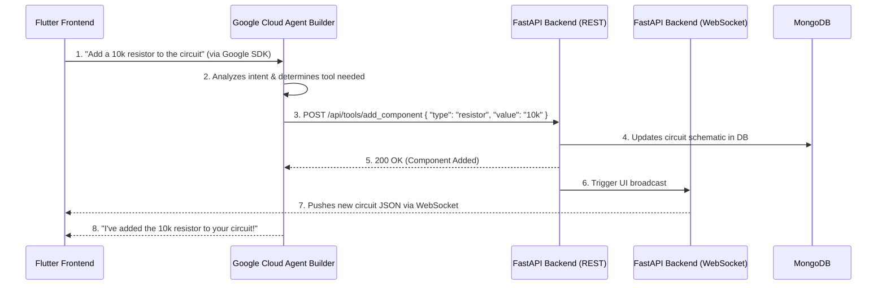

# Backend Migration Guide: Google Cloud Agent Builder

This document outlines the architectural changes needed to integrate our Electronic Circuit Simulator with the **Google Cloud Agent Builder** for the hackathon. 

## The Architectural Shift (Hybrid Model)

To qualify for the hackathon, our AI Agent must be hosted and orchestrated within **Google Cloud Agent Builder** rather than using our custom Python orchestration loop. 

Because Google Cloud Agent Builder uses standard **OpenAPI (Swagger)** specifications to connect to external tools, it **cannot** call custom WebSockets. It must use standard REST APIs (like `POST` or `GET`). 

However, we want to maintain our ultra-fast UI updates. To solve this, we are adopting a **Hybrid Architecture**:
1.  **Agent -> Backend (REST):** Google Cloud Agent Builder calls our backend tools via REST API.
2.  **Backend -> Frontend (WebSocket):** When the backend receives a REST call, it updates the database and immediately broadcasts the changes to the Flutter frontend over our existing `/ws/simulate` WebSocket.

### The Flowchart

---

## Developer To-Do List

Please implement these steps inside the newly created `app/google_agent` folder to avoid breaking our current, working system.

- [ ] **Step 1: Expose IDE Tools as REST Endpoints**
  Create a new router (e.g., `app/google_agent/tool_endpoints.py`). Wrap the existing functions from `app/agent/ide_tools.py` (like `add_component`, `add_wire`, `delete_element`) into standard `POST` endpoints. Ensure they accept strict JSON payloads (Pydantic models).

- [ ] **Step 2: Generate OpenAPI Specification**
  FastAPI automatically generates an OpenAPI spec at `/openapi.json`. Ensure your new tool endpoints are clearly documented with docstrings and type hints, as Google Cloud Agent Builder will read this file to understand how to use your tools.

- [ ] **Step 3: Implement WebSocket Broadcasting**
  Modify your new REST endpoints so that whenever a circuit is updated, the backend triggers a broadcast message to the specific user's connected `/ws/simulate` WebSocket. 

- [ ] **Step 4: MongoDB MCP Server Integration**
  For the hackathon partner requirement, we must run the MongoDB MCP server. Write a Python script/service in `app/google_agent/` that can spawn `npx -y @modelcontextprotocol/server-mongodb`. Ensure this MCP server is accessible to the Google Cloud Agent Builder as a data source.
